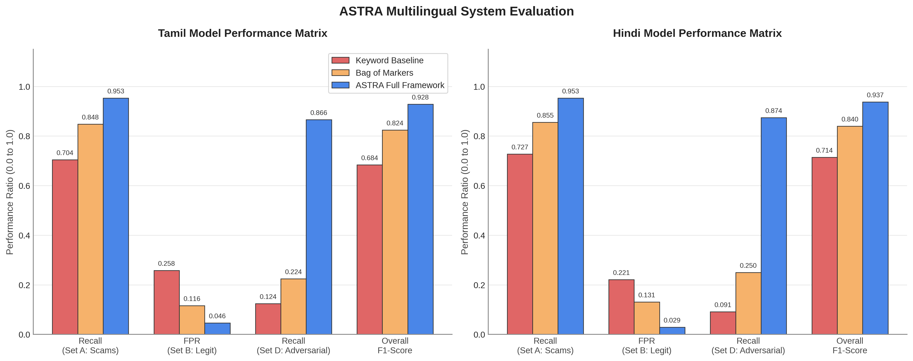
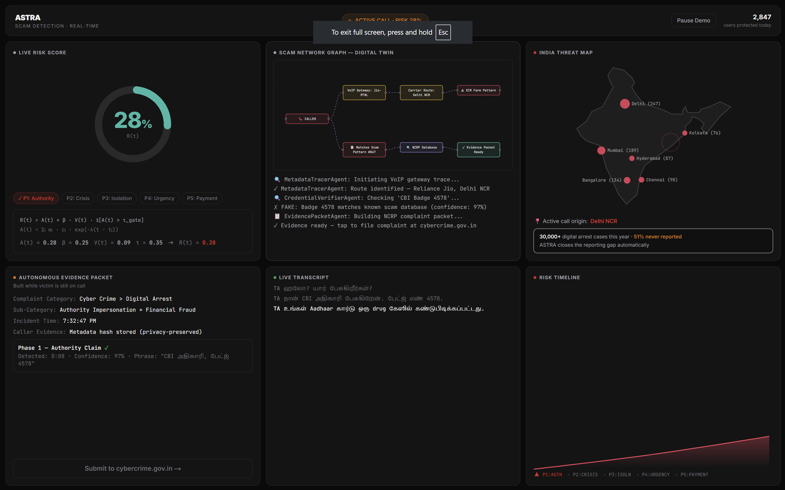
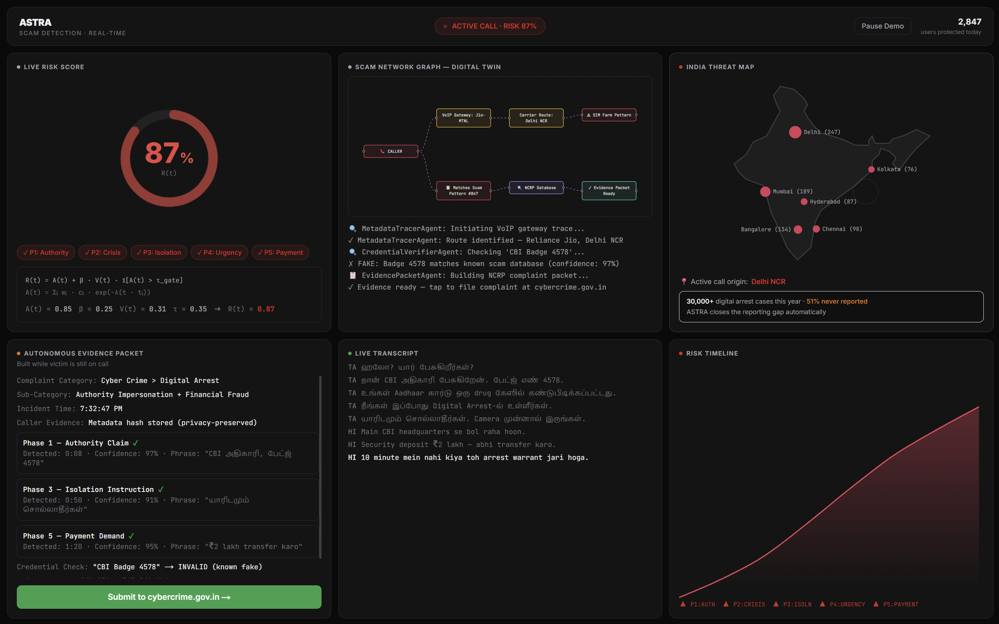
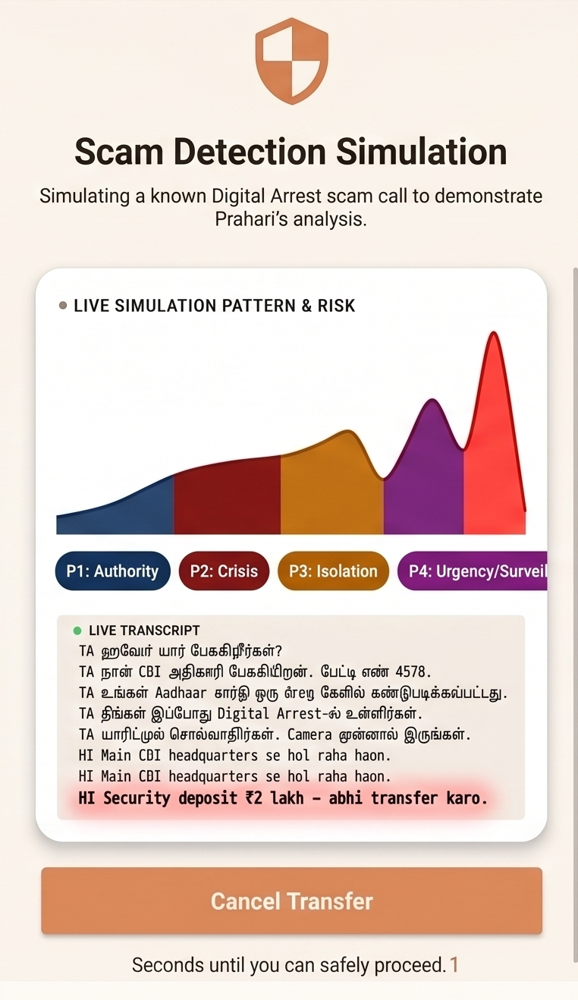
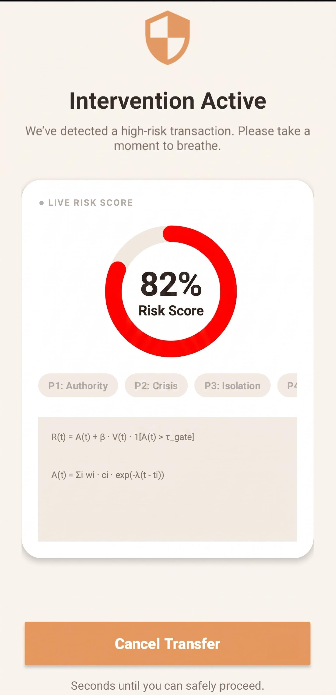
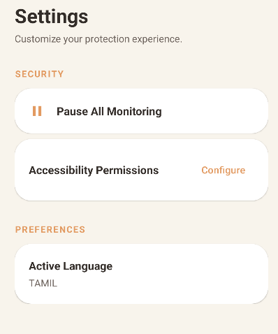
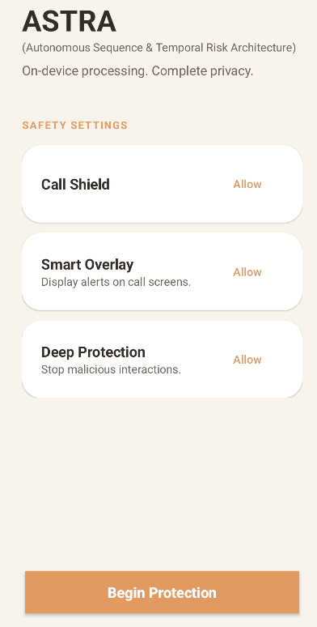

# ASTRA: Development Progress Till Now

We are actively developing ASTRA to be the first defense layer that operates *during* a scam call. Here is our development progress so far:

### 1. Model Training & Dataset Preparation
We have successfully curated the required datasets and trained our core machine learning models to recognize the canonical five-phase coercion arc (Authority Claim → Crisis Framing → Isolation → Urgency Escalation → Payment Demand) in real-time. 

**Dataset Curation:** 
Because public multilingual scam transcripts do not exist, we built a robust hybrid pipeline:
- **ASR & Code-Mixing:** Curated from IndicVoices, Mozilla Common Voice Tamil, and DravidianCodeMix.
- **Scam Patterns & Deepfakes:** BothBosu Multi-Agent simulations and FakeAVCeleb datasets.
- **Synthetic Gap-Filler:** Utilized Gemini 1.5 Pro to generate 500+ code-mixed scripts (Hindi-English, Tamil-English) strictly following the 5-phase coercion arc.

**Training & Testing Methodology:**
We fine-tuned a DistilBERT-multilingual classifier on noise-augmented text (simulating real ASR errors and hesitation markers) using sequential phase-gating formulas instead of simple keyword matching. The architecture was rigorously evaluated across 5 held-out adversarial test sets—ensuring high recall on disguised scam scripts while strictly suppressing false positives on real bank/police calls.

**System Evaluation:**

### TAMIL EVALUATION RESULTS
| Metric | Keyword Only | Bag of Markers | ASTRA Full |
| :--- | :---: | :---: | :---: |
| Recall (Set A - Scams) | 0.704 | 0.848 | 0.953 |
| FPR (Set B - Legit) | 0.258 | 0.116 | 0.046 |
| Recall (Set D - Adversarial) | 0.124 | 0.224 | 0.866 |
| **Overall F1-Score** | **0.684** | **0.824** | **0.928** |

### HINDI EVALUATION RESULTS
| Metric | Keyword Only | Bag of Markers | ASTRA Full |
| :--- | :---: | :---: | :---: |
| Recall (Set A - Scams) | 0.727 | 0.855 | 0.953 |
| FPR (Set B - Legit) | 0.221 | 0.131 | 0.029 |
| Recall (Set D - Adversarial) | 0.091 | 0.250 | 0.874 |
| **Overall F1-Score** | **0.714** | **0.840** | **0.937** |

### 2. Web Dashboard Demo
We have commenced building the Web App demo. This serves as a centralized Next.js command dashboard powered by an async FastAPI backend.

**The Autonomous Evidence Swarm:**
To combat the 51% incident non-reporting gap, the backend triggers a LangGraph state machine the moment risk crosses `0.55`:
- **MetadataTracerAgent:** Logs VoIP gateway signatures and carrier routing.
- **CredentialVerifierAgent:** Cross-references claimed "police badges" against known-fake ThreatDB databases.
- **EvidencePacketAgent:** Pre-compiles a complete NCRP (National Cyber Crime Reporting Portal) payload live *during* the call, requiring just one tap from the victim to file an official report.

**Dashboard (Low Risk)**  

**Dashboard (High Risk)**  

### 3. Android Application Demo
We have initiated the development of the ASTRA Android App demo. This on-device application is engineered to intercept scam calls dynamically. 

**Technical Highlights:**
- **Cascaded Edge Inference:** Runs 100% offline using Whisper.cpp (Tiny ASR) and quantized DistilBERT INT8 for classification. This layered activation keeps battery drain negligible (~8%/hr).
- **Architecturally Enforced Privacy:** Audio and video never leave the device. The app only transmits an anonymized `0-1` risk score and hashed caller ID to the backend.
- **Payment Circuit-Breaker:** When risk `R(t) > 0.80`, it uses a `PACKAGE_USAGE_STATS` / Accessibility overlay to block Google Pay/PhonePe with a mandatory 60-second cooling-off screen.

| Android Setup | Android Settings |
|:---:|:---:|
|  |  |
|  |  |
